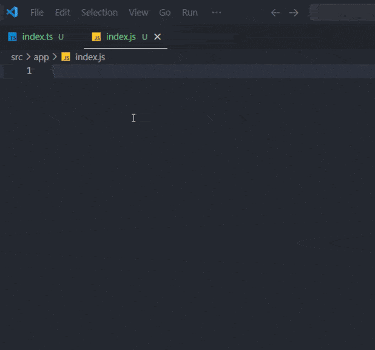

# arrow-fun-snippets

Make your code faster

## Snippets on JS/JSX

| Snippet | Renders                                       |
| ------- | --------------------------------------------- |
| `arr`   | Void arrow function                           |
| `arrp`  | Arrow function with params                    |
| `arrc`  | Arrow function with params                    |
| `arrcp`  | Const arrow function with params             |

## Snippets on TS/TSX

| Snippet | Renders                                       |
| ------- | --------------------------------------------- |
| `arr`   | Void arrow function                           |
| `arrp`  | Arrow function with params (with types)       |
| `arrc`  | Arrow function with params                    |
| `arrcp`  | Const arrow function with params (with types)|

## Feedback
This is my first extension, any feedback is appreciated!.

